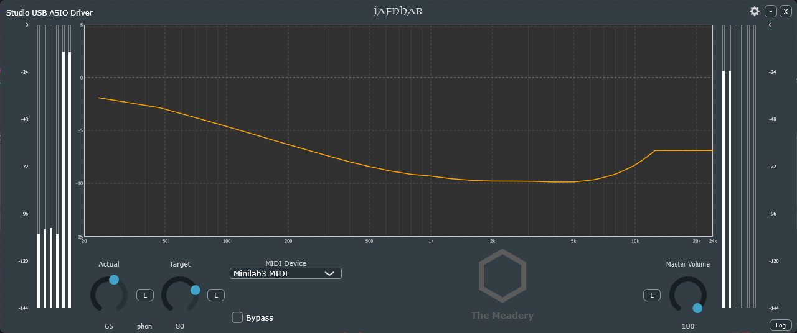

# Jafnhár

## Theory - What Does It Do?

ISO 226 is a standard for applying normal equal-loudness-level contours. It's like the "loudness" button on an old home theater amp.

Imagine you are listening to a song at low volume levels, say ~60 dB. You might wonder why there is not a lot of bass. That's because when the music was mixed in the studio the sound engineer was mixing at a much higher level - at least 80 dB. Listening to the same track at 60 dB our ears are not very sensitive to the bass at that level. It needs a boost to sound the same as it did to the sound engineer. That's where ISO 226 steps in to fix that problem and it does it in the most scientifically accurate way possible. The architects of ISO 226 have spent decades modeling the frequency response of the human ear and tweaking the curve to be as accurate as possible.

## Requirements

- ASIO® Audio Interface
- Audio Loopback
- Windows 10/11
- MIDI Controller (optional)

A MIDI controller is optional so that you may control the knobs without using the mouse. The idea in the future is to be able to control the app without having it in focus, especially the master volume with respect to the actual/target knob ratio.

## Audio Routing

You will need to loopback your audio so you can process it through the app. I personally do this with my SPDIF out/in. This let's Windows apps that can only sink to WASAPI/MME/DirectSound get processed. If your audio interface comes with a clever way to loopback properly you can use that as well. Using VB-Audio solutions such as VB-Cable and Matrix will work as well.

## File Locations

The settings database and logs are located in the following directories:

| File        | Windows                                 | macOS                                                    | Linux                                     |
|-------------|-----------------------------------------|----------------------------------------------------------|-------------------------------------------|
| `.settings` | `%APPDATA%\jafnhar\jafnhar.settings`    | `~/Library/Application Support/jafnhar/jafnhar.settings` | `~/jafnhar/jafnhar.settings`              |
| `log.txt`   | `%APPDATA%\jafnhar\log.txt`             | `~/Library/Application Support/jafnhar/log.txt`          | `~/.config/jafnhar/log.txt`               |

The alpha release will be shipped without an installer. It can be launched from any directory. For now I am only compiling for Windows and Linux, so the macOS directories above are not tested.

## FAQ

**Q: Why is the curve flat from approximately 12 kHz and up?**
> The ISO standard does not provide data points above 12,500 Hz. Any charts you see with curves above that level are just interpretations of what the author thinks it should look like. I have taken a look at several examples of how others have implemented the curve in this area. I have not yet decided how I want to handle it, so I have taken the only neutral option available of just extending the curve flat out to Nyquist for now.

## Etymology and Meaning

The word is a compound formed by two distinct elements:

1. **Jafn**: (Adjective) Meaning "even," "equal," "plain," or "the same." It is the ancestor of the modern Scandinavian word *jämn*.

2. **Hár**: (Adjective) Meaning "loud" or "high."

Joined together, **Jafnhár** literally means "equally loud" or "of the same height." In a physical sense, it was used to describe two people of the same stature or two walls of equal height. In an acoustic context, it perfectly describes the "equal loudness" goal of the ISO 226 standard.

**Pronunciation**: Roughly pronounced "YAF-nhow-er" (The 'j' is a 'y' sound, and the 'á' is a long 'ow' like in "now").

## TODO

- Calibration feature to allow locking master volume to Actual/Target with ratio
- In-app update system

## Attributions

  
ASIO is a registered trademark of Steinberg Media Technologies GmbH.
